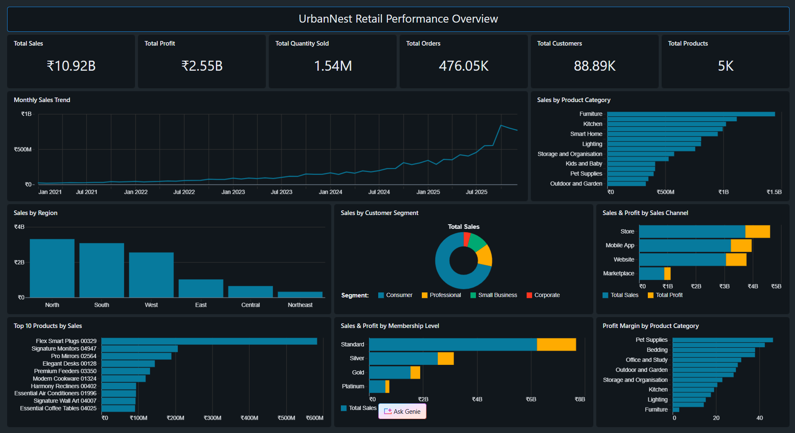
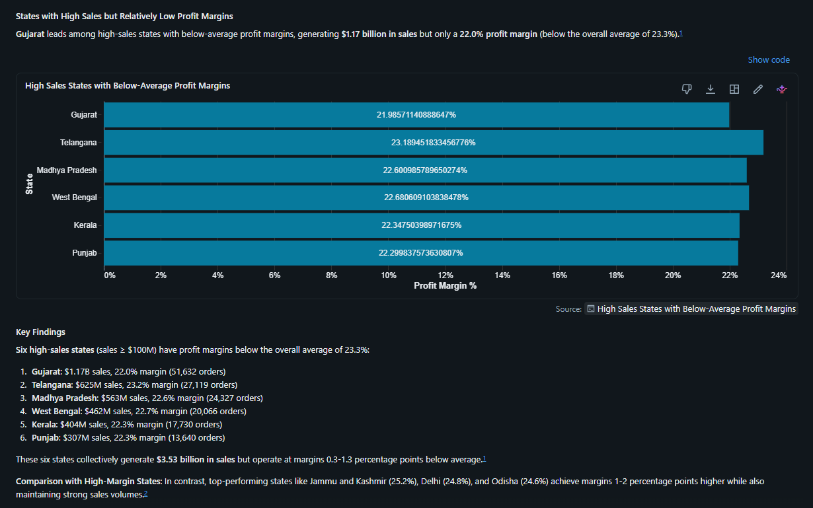
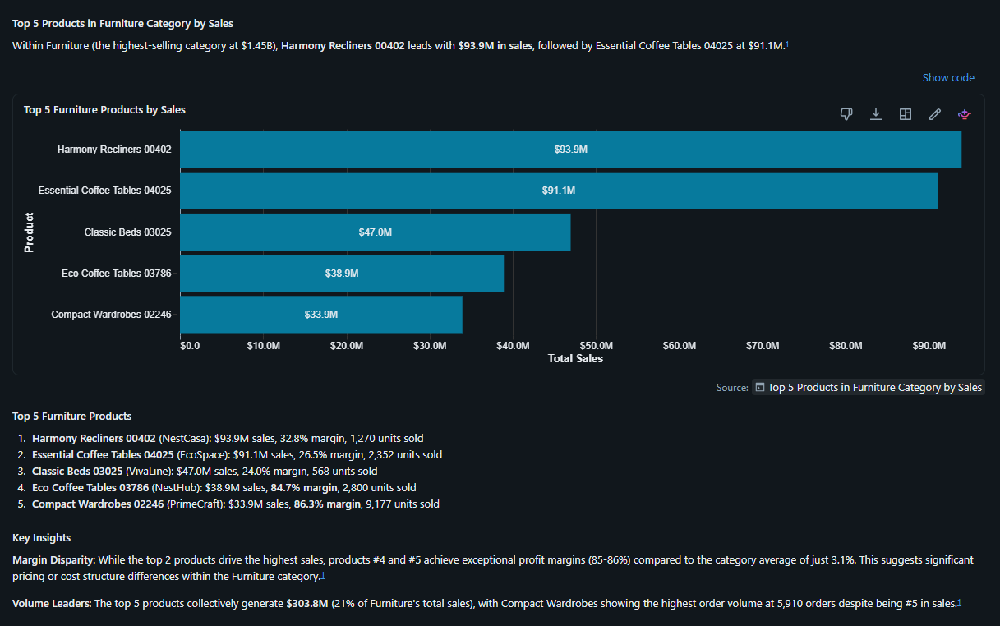
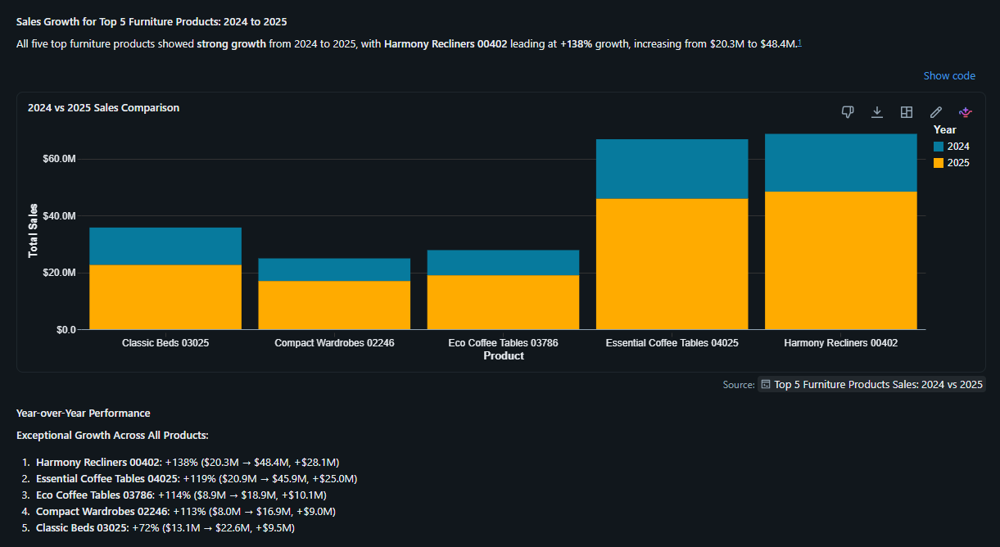
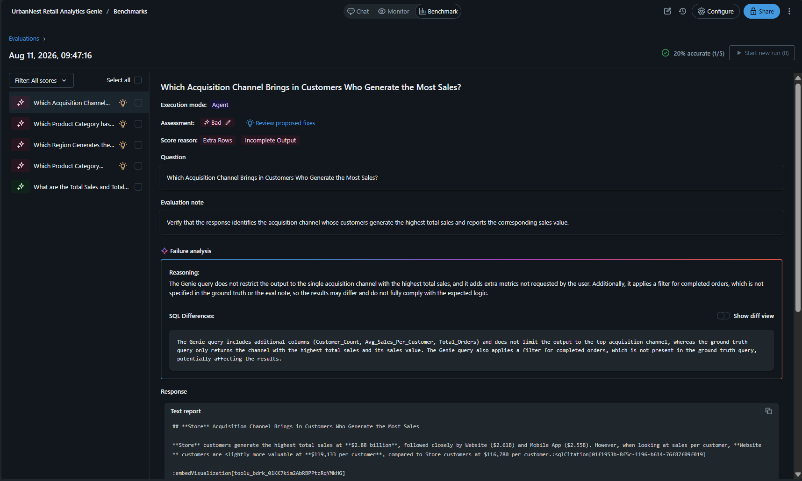
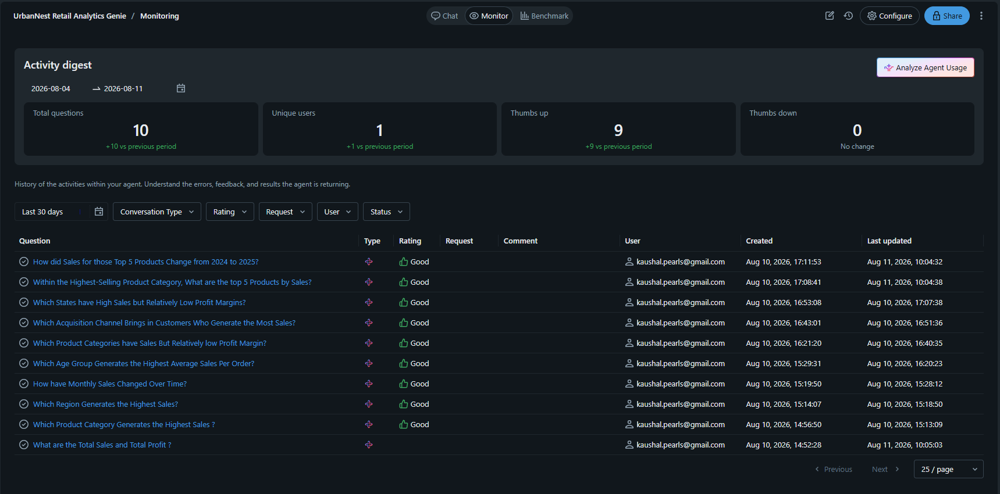
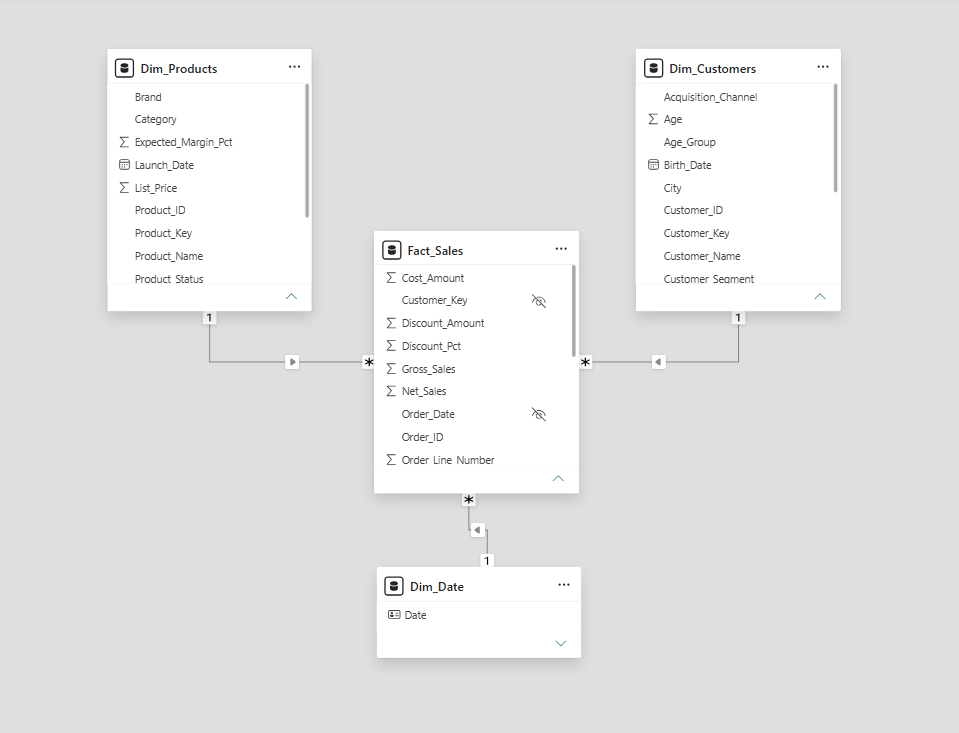
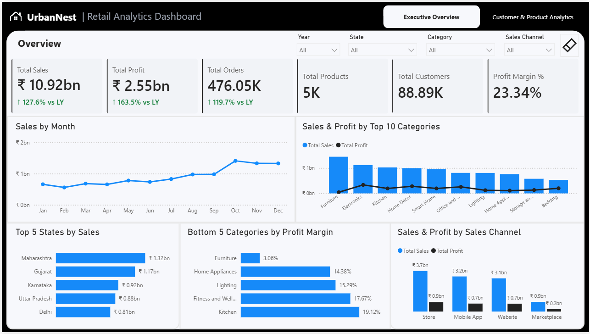
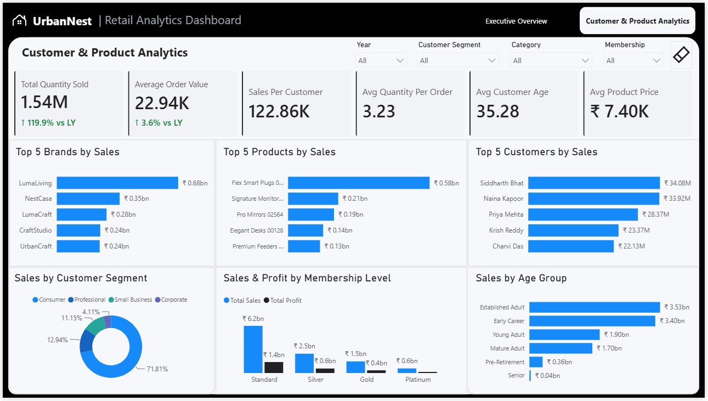

# 🏙️ UrbanNest Retail Analytics with Databricks

> An end-to-end retail analytics project built using **Databricks SQL, AI/BI Dashboards, AI/BI Genie, and Power BI** to transform large-scale retail data into business-ready insights through SQL analytics, conversational AI, and interactive business intelligence dashboards.

<p align="center">


</p>

---

# 📖 Table of Contents

- [Project Overview](#-project-overview)
- [Business Problem](#-business-problem)
- [Project Objectives](#-project-objectives)
- [Project Architecture](#-project-architecture)
- [Analytics Workflow](#-analytics-workflow)
- [Dataset Overview](#-dataset-overview)
- [Gold Layer Data Model](#-gold-layer-data-model)
- [Data Exploration](#-data-exploration)
- [SQL Business Analysis](#-sql-business-analysis)
- [Databricks Dashboard](#-databricks-dashboard)
- [AI-Powered Analytics with Databricks Genie](#-ai-powered-analytics-with-databricks-genie)
- [Genie Evaluation & Monitoring](#-genie-evaluation--monitoring)
- [Power BI Analytics](#-power-bi-analytics)
- [Power BI Data Model](#-power-bi-data-model)
- [DAX & Time Intelligence](#-dax--time-intelligence)
- [Executive Overview](#-executive-overview)
- [Customer & Product Analytics](#-customer--product-analytics)
- [Key Business Insights](#-key-business-insights)
- [Repository Structure](#-repository-structure)
- [Technology Stack](#-technology-stack)
- [Skills Demonstrated](#-skills-demonstrated)
- [Project Status](#-project-status)
- [Future Improvements](#-future-improvements)
- [License](#-license)
- [Author](#-author)

---

# 📌 Project Overview

**UrbanNest Retail Analytics** is an end-to-end analytics project designed to demonstrate how a modern retail organization can use **Databricks and Power BI** to analyze large-scale transactional data and convert it into actionable business insights.

The project analyzes approximately:

- **1,000,000 sales transactions**
- **100,000 customers**
- **5,000 products**
- **5 years of retail activity (2021–2025)**

A business-ready **Gold Layer** provides the analytical foundation for SQL analysis, Databricks dashboards, conversational analytics with **AI/BI Genie**, and interactive reporting in **Power BI**.

The project demonstrates the complete analytical workflow from curated data to business decision support.

---

# 💼 Business Problem

Large retail organizations generate substantial amounts of transactional data across customers, products, stores, sales channels, and geographic locations.

However, raw transactional data alone does not answer important business questions such as:

- How are sales and profit changing over time?
- Which product categories generate the highest revenue?
- Which categories generate strong sales but weak margins?
- Which states contribute the most sales?
- Which sales channels generate the strongest performance?
- Which products and brands are driving revenue?
- Which customers contribute the most value?
- How does customer behavior vary by segment, age group, and membership level?

UrbanNest requires a scalable analytics solution that allows both technical and non-technical users to explore these questions efficiently.

This project addresses that requirement through **SQL analytics, dashboards, conversational AI, and Power BI reporting**.

---

# 🎯 Project Objectives

The primary objectives of this project are:

- Analyze large-scale retail data using **Databricks SQL**.
- Build a clean, business-ready **Gold Layer** for analytics.
- Design a dimensional model suitable for BI reporting.
- Perform exploratory and business-focused SQL analysis.
- Develop an interactive **Databricks AI/BI Dashboard**.
- Configure **AI/BI Genie** for natural-language business analysis.
- Evaluate Genie's ability to answer analytical questions accurately.
- Test context-aware follow-up analysis in Genie.
- Connect Databricks analytical data to **Power BI**.
- Create reusable DAX measures and time-intelligence calculations.
- Build executive and customer/product-focused Power BI reports.
- Demonstrate an end-to-end modern analytics workflow.

---

# 🏗 Project Architecture

The project follows a modern analytical architecture where Databricks acts as the central analytics platform and the curated Gold Layer serves multiple downstream analytical experiences.

```text
                     Retail Data
                          │
                          ▼
                  Databricks Platform
                          │
                          ▼
                 Business-Ready Gold Layer
                          │
              ┌───────────┼────────────┐
              │           │            │
              ▼           ▼            ▼
        Databricks     AI/BI        Power BI
        SQL Analysis    Genie        Analytics
              │           │            │
              ▼           ▼            ▼
          Business     Natural      Interactive
          Insights     Language     BI Reporting
                       Analytics
```

This architecture enables the same trusted analytical data to support:

- SQL-based exploration
- Executive dashboarding
- Natural-language analytics
- External BI reporting

---

# 🔄 Analytics Workflow

The project was developed through the following analytical workflow:

```text
Retail Dataset
      │
      ▼
Databricks Environment
      │
      ▼
Data Exploration & Validation
      │
      ▼
Gold Layer Star Schema
      │
      ├──────────────► SQL Business Analysis
      │
      ├──────────────► Databricks AI/BI Dashboard
      │
      ├──────────────► Databricks AI/BI Genie
      │
      └──────────────► Power BI
                           │
                           ▼
                    Interactive Business
                         Reporting
```

Each stage builds on the same curated analytical foundation, ensuring consistency across SQL, Genie, Databricks dashboards, and Power BI.

---

# 📊 Dataset Overview

The project uses a large synthetic retail dataset representing UrbanNest's customer, product, and sales operations.

| Dataset | Approximate Records | Purpose |
|---|---:|---|
| Customers | 100,000 | Customer profile, demographics, segmentation, and membership |
| Products | 5,000 | Product, brand, category, and pricing information |
| Sales | 1,000,000 | Transaction-level retail sales activity |

### Time Period

**2021 – 2025**

The dataset provides sufficient scale and dimensional variety to perform:

- Time-series analysis
- Customer analytics
- Product analytics
- Geographic analysis
- Sales channel analysis
- Profitability analysis
- AI-powered business questioning

---

# ⭐ Gold Layer Data Model

The analytical Gold Layer is organized using a **Star Schema**, separating transactional sales activity from descriptive customer and product attributes.

### Core Gold Tables

| Table | Type | Purpose |
|---|---|---|
| `fact_sales` | Fact | Transaction-level sales and financial measures |
| `dim_customers` | Dimension | Customer demographics, segment, and membership information |
| `dim_products` | Dimension | Product, brand, category, and pricing information |

The fact table acts as the central analytical table while the dimensions provide business context for slicing and analyzing retail performance.

### Benefits of the Model

- Simplifies analytical SQL queries
- Improves BI usability
- Separates measures from descriptive attributes
- Supports reusable business reporting
- Provides a consistent source for Databricks and Power BI
- Supports natural-language analysis through Genie

---

# 🔍 Data Exploration

Before developing dashboards and AI-powered analytics, the data was explored and validated in Databricks.

The exploration process included:

- Reviewing table structures and column definitions
- Validating record counts
- Checking null values
- Reviewing categorical distributions
- Inspecting customer attributes
- Inspecting product hierarchy
- Understanding sales measures
- Reviewing date coverage
- Validating relationships between analytical tables

This phase ensured that the Gold Layer was suitable for downstream business analysis.

---

# 📈 SQL Business Analysis

Databricks SQL was used to answer practical retail business questions and validate analytical patterns before dashboard development.

Analysis focused on areas including:

### Sales Performance

- Overall sales performance
- Monthly and yearly sales trends
- Sales contribution by product category
- Geographic sales performance
- Sales channel performance

### Profitability

- Overall profit
- Profit margin
- Profitability by product category
- Identification of high-sales, low-margin categories

### Product Performance

- Top-selling product categories
- Top-performing individual products
- Brand-level performance
- Product sales contribution

### Customer Analysis

- Customer segment performance
- Membership-level performance
- Customer demographic patterns
- Top customers by sales

SQL analysis served as the foundation for selecting meaningful KPIs and visualizations for the reporting layer.

---

# 📊 Databricks Dashboard

An interactive **Databricks AI/BI Dashboard** was developed directly on top of the analytical Gold Layer.

The dashboard provides an initial business reporting layer within Databricks and allows users to explore UrbanNest's retail performance without leaving the platform.

### Key KPIs

- Total Sales
- Total Profit
- Total Orders
- Total Customers
- Total Products
- Total Quantity Sold
- Profit Margin %

### Analytical Views

The dashboard includes analysis across:

- Sales trends
- Product categories
- Profit margins
- Geographic regions
- Sales channels
- Customer segments
- Membership levels

<p align="center">

</p>

The Databricks dashboard provides a centralized operational view of retail performance while also serving as a foundation for deeper analysis using Genie and Power BI.

---

# 🤖 AI-Powered Analytics with Databricks Genie

A dedicated **Databricks AI/BI Genie Space** was configured on top of the curated Gold Layer.

Genie enables business users to explore UrbanNest's data using **natural-language questions instead of manually writing SQL queries**.

The Genie Space was configured with business context and tested using multiple analytical question types.

### Analytical Capabilities Tested

- KPI retrieval
- Ranking analysis
- Product analysis
- Geographic analysis
- Profitability analysis
- Multi-metric comparisons
- Context-aware follow-up questions

---

## 💡 Business Question Example

### Which states have high sales but relatively low profit margins?

Genie was used to identify high-revenue states operating below the overall profit-margin benchmark.

<p align="center">

</p>

This demonstrates Genie's ability to interpret a business question involving **multiple metrics and a relative profitability benchmark**.

---

## 🧠 Context-Aware Follow-up Analysis

Genie was also tested for its ability to retain conversational context across related business questions.

The initial question asked:

> **Within the highest-selling product category, what are the top 5 products by sales?**

<p align="center">

</p>

The analysis was then continued with:

> **How did sales for those products change from 2024 to 2025?**

<p align="center">

</p>

This demonstrates Genie's ability to retain conversational context and support progressive drill-down analysis without requiring the user to restate the entire analytical problem.

---

# 🧪 Genie Evaluation & Monitoring

Genie was not treated only as a demonstration feature. Its analytical behavior was also evaluated to assess the reliability of natural-language responses.

Evaluation focused on:

- Question interpretation
- Metric selection
- Filtering logic
- Ranking accuracy
- Business context
- Follow-up context retention
- Consistency with underlying analytical data

<p align="center">

</p>

Monitoring capabilities were also reviewed to understand Genie usage and analytical behavior.

<p align="center">

</p>

Detailed documentation is available in the `docs/` directory.

---

# 📊 Power BI Analytics

The final stage of the project extends the Databricks analytical layer into **Microsoft Power BI**.

Power BI connects to the curated Databricks data and provides a polished reporting experience designed for executive monitoring and deeper customer/product analysis.

Rather than simply recreating the Databricks dashboard, the Power BI report was designed to provide **additional analytical perspectives while maintaining metric consistency with Databricks**.

The report contains two pages:

1. **Executive Overview**
2. **Customer & Product Analytics**

---

# ⭐ Power BI Data Model

A dedicated reporting model was created in Power BI using the Databricks Gold Layer.

The model follows a dimensional structure centered around sales transactions and descriptive dimensions.

A dedicated `Dim_Date` table was added to support time-intelligence calculations and consistent date filtering.

<p align="center">

</p>

### Modeling Approach

- Central Sales Fact table
- Customer Dimension
- Product Dimension
- Dedicated Date Dimension
- One-to-many relationships
- Single-direction filtering where appropriate
- Dedicated measure organization
- Separation of core measures and time-intelligence calculations

This design keeps the semantic model clean, reusable, and suitable for interactive reporting.

---

# 🧮 DAX & Time Intelligence

Reusable DAX measures were created to centralize business logic and avoid embedding calculations directly inside individual visuals.

### Core Measures

Examples include:

- Total Sales
- Total Profit
- Total Orders
- Total Products
- Total Customers
- Total Quantity Sold
- Profit Margin %
- Average Order Value
- Sales per Customer
- Average Quantity per Order
- Average Customer Age
- Average Product Price

### Time-Intelligence Measures

Year-over-year calculations were created for important executive metrics, including:

- Sales LY
- Sales Growth %
- Profit LY
- Profit Growth %
- Orders LY
- Orders Growth %
- Quantity LY
- Quantity Growth %
- AOV LY
- AOV Growth %

Dynamic growth labels and conditional formatting were also implemented to visually distinguish positive and negative performance changes.

---

# 📈 Executive Overview

The **Executive Overview** provides a high-level view of UrbanNest's overall retail performance.

### Key KPIs

- **Total Sales:** ₹10.92bn
- **Total Profit:** ₹2.55bn
- **Total Orders:** 476.05K
- **Total Products:** 5K
- **Total Customers:** 88.89K
- **Profit Margin:** 23.34%

Sales, Profit, and Orders also include **Year-over-Year growth indicators** for additional performance context.

### Visualizations

- Sales by Month
- Sales & Profit by Top 10 Categories
- Top 5 States by Sales
- Bottom 5 Categories by Profit Margin
- Sales & Profit by Sales Channel

### Interactive Filters

- Year
- State
- Category
- Sales Channel

<p align="center">

</p>

The page is designed to answer:

> **How is UrbanNest performing overall, and where are the strongest opportunities or profitability concerns?**

---

# 👥 Customer & Product Analytics

The second Power BI page provides deeper analysis of **customer behavior and product performance**.

### Key KPIs

- **Total Quantity Sold:** 1.54M
- **Average Order Value:** ₹22.94K
- **Sales per Customer:** ₹122.86K
- **Average Quantity per Order:** 3.23
- **Average Customer Age:** 35.28
- **Average Product Price:** ₹7.40K

Quantity Sold and Average Order Value also include **Year-over-Year growth indicators**.

### Product & Customer Performance

- Top 5 Brands by Sales
- Top 5 Products by Sales
- Top 5 Customers by Sales

### Customer Analysis

- Sales by Customer Segment
- Sales & Profit by Membership Level
- Sales by Age Group

### Interactive Filters

- Year
- Customer Segment
- Category
- Membership Level

<p align="center">

</p>

This page answers:

> **Which customers, products, and customer groups are driving UrbanNest's retail performance?**

---

# 💡 Key Business Insights

The analytical workflow surfaced several important business patterns.

### 🛋️ High Sales Does Not Always Mean High Profitability

Furniture emerged as a major sales contributor while operating at a significantly lower profit margin than several other categories.

This highlights the importance of analyzing **sales and profitability together**, rather than evaluating category performance using revenue alone.

### 📍 Geographic Performance Varies Beyond Sales

Some high-revenue states operate below the overall profit-margin benchmark, indicating that strong geographic sales performance does not automatically translate into equally strong profitability.

### 🛒 Customer Segment Concentration

Consumer customers represent the dominant share of sales, making the segment an important driver of UrbanNest's overall retail performance.

### 👑 Membership-Level Performance

Standard membership customers generate the largest sales and profit contribution, while higher membership tiers represent smaller but distinct customer groups.

### 📦 Product Performance Is Concentrated

Top products and brands contribute disproportionately to sales, making product-level ranking useful for merchandising and performance monitoring.

### 🤖 Conversational Analytics Supports Progressive Exploration

Genie successfully supported follow-up analysis where a product ranking question was extended into a year-over-year comparison without repeating the original analytical context.

This demonstrates how conversational analytics can complement traditional dashboards when users need fast exploratory answers.

---

# 📂 Repository Structure

```text
urbannest-retail-databricks-sql-analytics/
│
├── data/
│   └── gold/
│
├── dashboards/
│   ├── urbannest_retail_analytics_powerbi.pbix
│   └── urbannest_retail_performance_dashboard.png
│
├── docs/
│   ├── genie_business_questions.md
│   └── genie_evaluation.md
│
├── images/
│   ├── genie/
│   │   ├── category_profitability_analysis.png
│   │   ├── genie_benchmark_evaluation.png
│   │   ├── genie_monitoring.png
│   │   ├── product_yoy_followup_analysis.png
│   │   ├── state_sales_profit_analysis.png
│   │   └── top_5_furniture_products.png
│   │
│   └── powerbi/
│       ├── executive_overview.png
│       ├── customer_product_analytics.png
│       └── data_model.png
│
├── sql/
│   ├── analysis/
│   ├── dashboards/
│   └── exploration/
│
├── README.md
└── LICENSE
```

The repository separates analytical data, SQL scripts, dashboard assets, Genie documentation, and Power BI screenshots to keep the project modular and easy to navigate.

---

# 🛠 Technology Stack

| Category | Technology |
|---|---|
| Analytics Platform | Databricks |
| Query Language | SQL |
| Analytical Layer | Databricks Gold Layer |
| Data Modeling | Star Schema |
| SQL Analytics | Databricks SQL |
| Databricks Reporting | AI/BI Dashboards |
| Conversational Analytics | AI/BI Genie |
| BI & Visualization | Microsoft Power BI |
| BI Calculations | DAX |
| Time Intelligence | DAX + Date Dimension |
| Documentation | Markdown |
| Version Control | Git |
| Repository Hosting | GitHub |

---

# 💡 Skills Demonstrated

This project demonstrates an end-to-end modern retail analytics workflow covering SQL analysis, dimensional modeling, AI-powered analytics, dashboard development, and business intelligence.

## Databricks

- Databricks workspace usage
- Databricks SQL
- Gold Layer analytics
- Analytical data exploration
- SQL-based business analysis
- AI/BI Dashboard development

## SQL

- Aggregations
- Multi-table joins
- Common Table Expressions (CTEs)
- Window functions
- Ranking
- Date analysis
- Conditional logic
- Business KPI calculations
- Profitability analysis
- Customer and product analysis

## Data Modeling

- Fact and dimension modeling
- Star Schema design
- Relationship management
- Business-ready analytical structures
- Dedicated Date Dimension
- BI semantic modeling

## AI/BI Genie

- Genie Space configuration
- Natural-language analytics
- Business-context definition
- Analytical question design
- Multi-metric questioning
- Context-aware follow-up analysis
- Genie benchmark evaluation
- Monitoring and validation

## Power BI

- Databricks integration
- Data modeling
- DAX measures
- Time intelligence
- KPI design
- Conditional formatting
- Top-N analysis
- Interactive slicers
- Cross-filtering
- Page navigation
- Executive dashboard design
- Customer analytics
- Product analytics
- Business storytelling

## Documentation & Version Control

- Technical documentation
- Markdown
- Repository organization
- Git
- GitHub
- Project documentation
- Analytical workflow documentation

---

# ✅ Project Status

**Completed**

- ✅ Project Planning
- ✅ Databricks Setup
- ✅ Data Exploration
- ✅ Gold Layer Analytics
- ✅ SQL Business Analysis
- ✅ Databricks Dashboard
- ✅ AI/BI Genie Configuration
- ✅ Genie Business Question Testing
- ✅ Genie Evaluation & Monitoring
- ✅ Databricks to Power BI Integration
- ✅ Power BI Data Modeling
- ✅ DAX Measures
- ✅ Time Intelligence
- ✅ Executive Overview
- ✅ Customer & Product Analytics
- ✅ Documentation
- ✅ GitHub Repository

---

# 🚀 Future Improvements

Potential future enhancements include:

- Add automated refresh workflows for continuously updated retail data.
- Expand the Gold Layer with additional operational datasets.
- Introduce more advanced customer segmentation techniques.
- Add product-level profitability and inventory analysis.
- Expand Genie benchmark questions for broader analytical evaluation.
- Add forecasting for sales and product demand.
- Introduce additional Power BI drill-through or tooltip experiences.
- Explore Databricks machine-learning capabilities for predictive retail analytics.

---

# 📄 License

This project is licensed under the **MIT License**.

You are free to use, modify, and distribute this project with proper attribution.

See the `LICENSE` file for more information.

---

# 👨‍💻 Author

**Kaushal Chanchadiya**

Aspiring Data Analyst focused on transforming large-scale data into meaningful business insights using **SQL, Databricks, Power BI, Python, and modern analytics techniques**.

### Connect with Me

- 💼 **LinkedIn:** `https://www.linkedin.com/in/kaushalchanchadiya162004`
- 💻 **GitHub:** `https://github.com/Chanchadiyakaushal201`

---

## ⭐ If you found this project useful

If this repository helped you learn about **Databricks SQL, AI/BI Genie, Power BI, or modern retail analytics**, consider giving it a ⭐ on GitHub.

Feedback and suggestions are always welcome!
